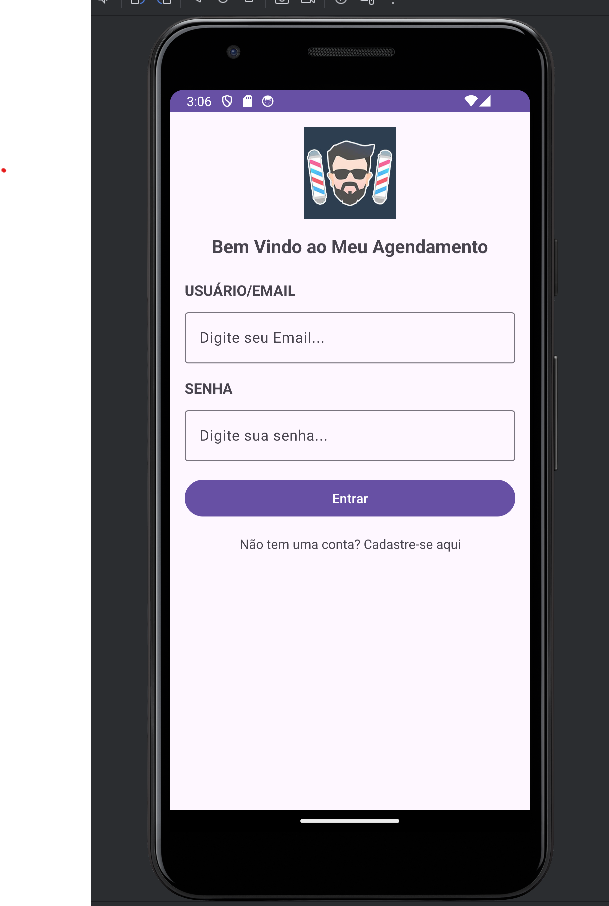
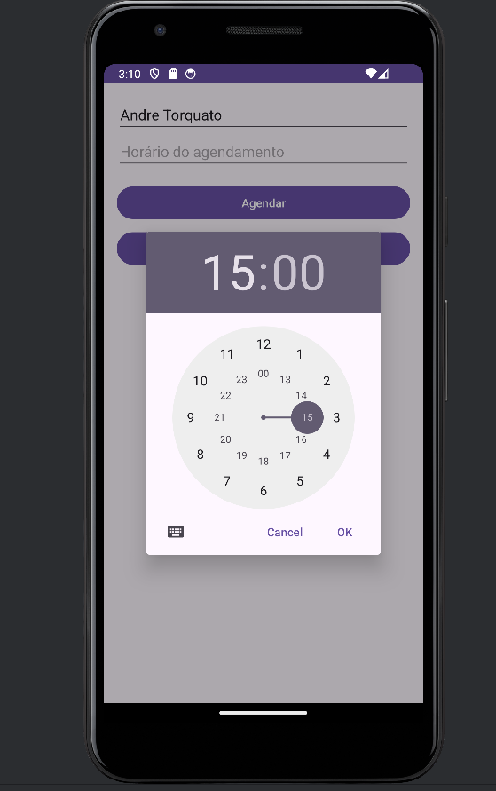
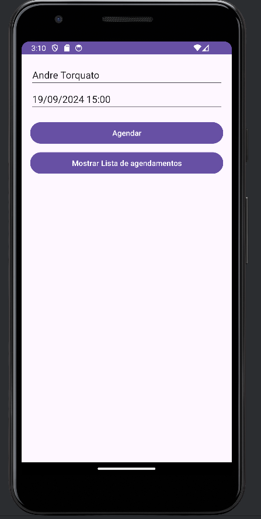
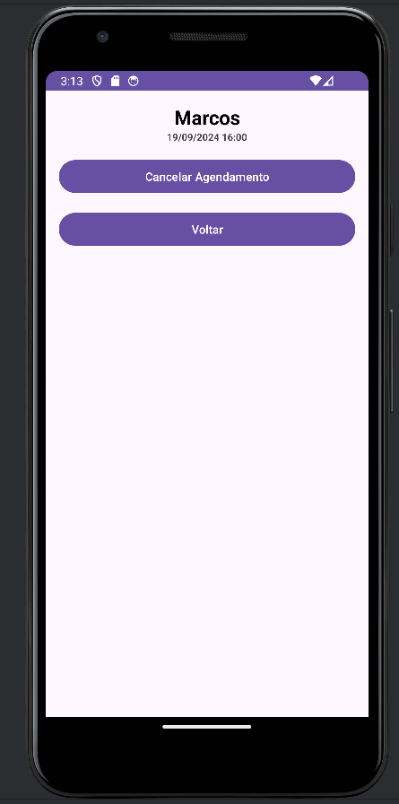
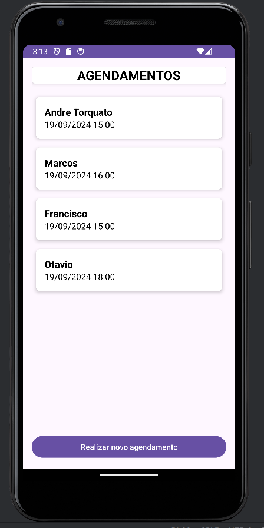

# Meus Agendamentos

O aplicativo tem o intuito de ajudar na organização de agendamentos dos clientes de uma barbearia, para que o barbeiro consiga gerência melhor os seus atendimentos por horario, 
onde conseguira visualizar os seus clientes agendados no dia atual e os próximos clientes agendados durante a semana

## Principais funcionalidades da aplicação

| Funcionalidade | descrição | status |
| --- | --- | --- |
| 1.1 | O usuário pode fazer login no sistema | finalizado |
| 1.2 | O usuário pode realizar agendamento no sistema | finalizado |
| 1.3 | O usuário pode visualizar todos os agendamentos do dia | finalizado |
| 1.4 | O usuário pode visualizar os agendamentos dos próximos dias | finalizado |
| 1.5 | O usuário pode visualizar um agendamento especifico | finalizado |
| 1.6 | O usuário pode cancelar um agendamento | finalizado |
| 1.7 | O usuário pode cadastrar-se no sistema | em andamento |
| 1.8 | O usuário pode visualizar os agendamentos dos próximos dias | em andamento |
| 1.9 | O usuário pode marcar um agendamento como finalizado | em andamento |

**O usuário pode fazer login no sistema**

  

**O usuário pode realizar agendamento no sistema**

  

  

**O usuário pode visualizar um agendamento especifico**

  

**O usuário pode visualizar todos os agendamentos do dia**

  

**O usuário pode cancelar um agendamento**

  

## Conclusão 

Para a parte de autenticação foi realizado integração com o `Firebase` para realizar o gerenciamento de login e cadastro de novos usuários, para a parte de persistência dos dados, cadastro, exclusão e modificação de dados foi utilizado o `ROOM Database`, para listagem dos dados foram utilizados `RecycleView`, `CardView`, `Services` e `FrameLayout`.

obs: para rodar o projeto é necessario criar um novo projeto no firebase e adicionar ao projeto as credencias `google-service.json`